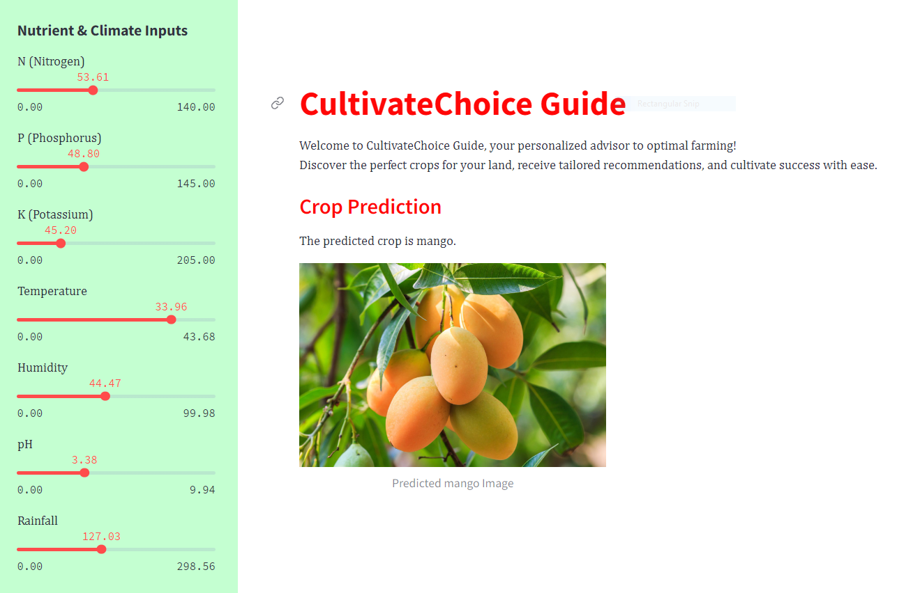
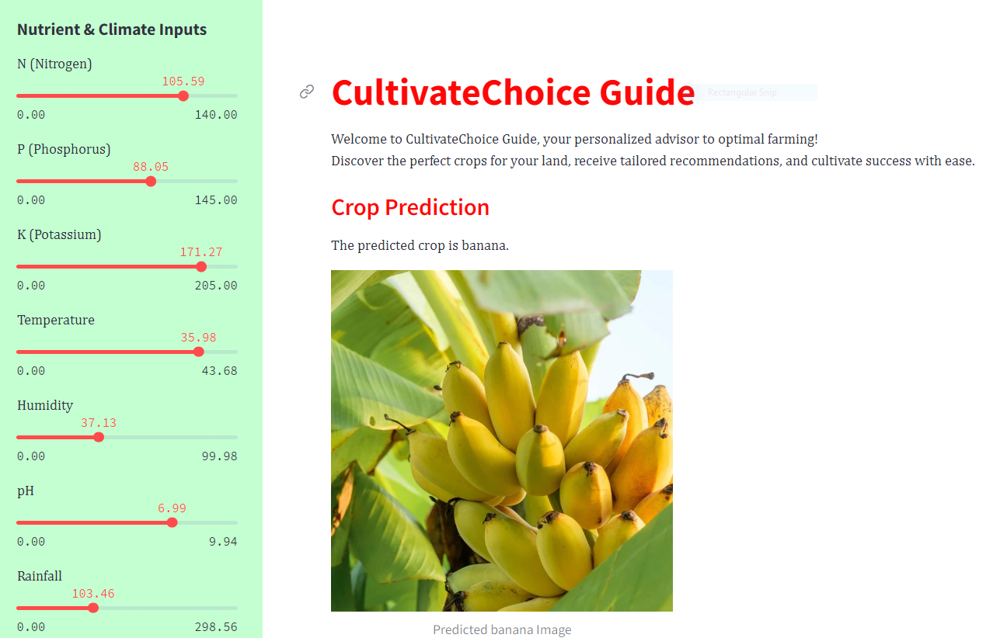

# Crop Recommendation App using Streamlit

 

This is a simple web application built with Streamlit that provides crop recommendations based on user input. The app takes into account various factors such as soil type, temperature, humidity, and rainfall to suggest suitable crops for cultivation.

## Features
- **User-friendly Interface:** The app offers an intuitive and easy-to-use interface for users to input relevant information.
- **Data-Driven Recommendations:** Crop recommendations are generated using a data-driven approach, considering key environmental factors.
- **Real-time Results:** Instantly view the recommended crops along with additional details such as planting season and soil requirements.

## Try it out!
Visit the Crop Recommendation App [here](https://crop-recommendation-app-bd.streamlit.app/) to explore the functionalities and receive personalized crop recommendations.

